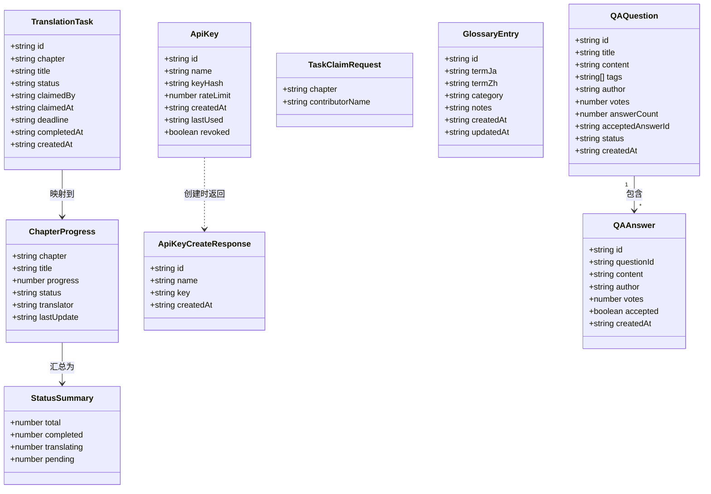
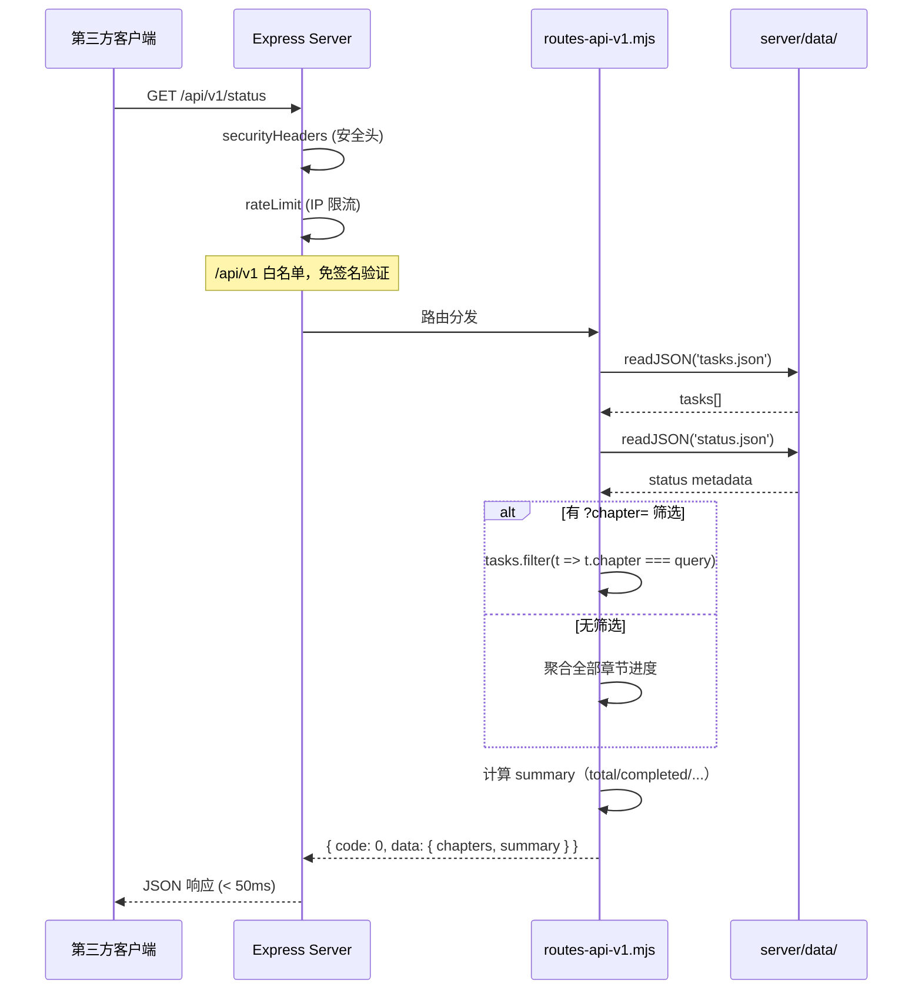
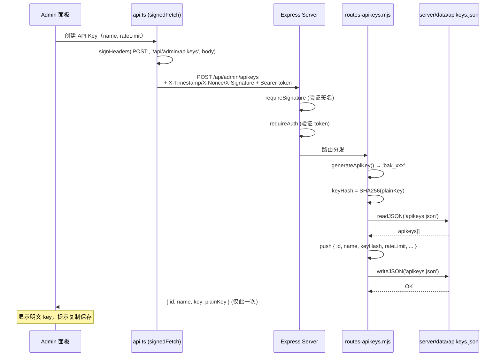
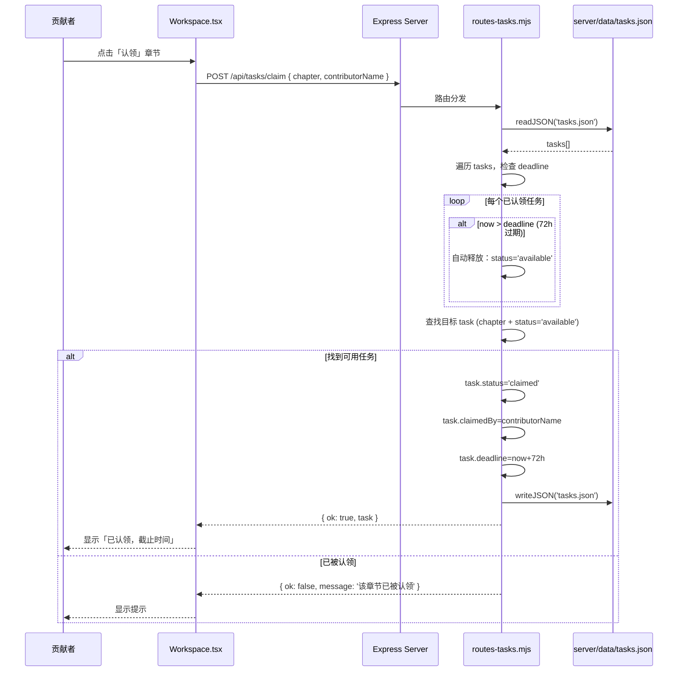
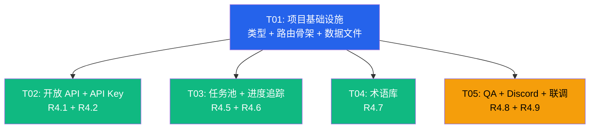

# 蔚蓝档案汉化组官网 — 阶段四系统设计

> 架构师：高见远（Bob） | 日期：2026-08-12

---

## Part A：系统设计

### 1. 实现方案与框架选型

#### 核心技术挑战

| 挑战 | 分析 | 方案 |
|------|------|------|
| **开放 API 性能** | GET /api/v1/status 要求 < 50ms，JSON 文件读取本身已足够快 | 无缓存层，直接 fs.readFile + 可选 chapter 内存过滤 |
| **API Key 安全存储** | 不能明文存 key，需要 hash 验证 | SHA256(key) 存储，创建时仅返回一次明文 |
| **任务自动释放** | 72h 未提交需自动释放，但不能依赖定时任务（单进程） | 懒检查：查询/认领时检查 deadline，过期自动释放 |
| **QA 敏感词** | 复用已有 `checkSensitiveWords` | 提交时调用，标记 `pending` 状态 |
| **Discord Webhook** | 纯配置驱动 | 存 `settings.discordWebhook`，Admin 面板可编辑 |

#### 框架与库

由于 PRD 已明确技术栈，**阶段四不引入新依赖**：

- **后端**：Express 5（已有）— 所有新路由挂载到现有 `api` Router 或新建子 Router
- **前端**：React 19 + TS + TailwindCSS 3 + Lucide React（已有）
- **存储**：JSON 文件（`server/data/`）— 沿用现有 `readJSON` / `writeJSON` 工具函数模式
- **安全**：管理员接口使用 Bearer session token，公共 API 使用限流，API Key 使用独立环境变量 secret

#### 架构模式

保持现有三层结构：

```
前端 (React SPA)
  └─ src/lib/api.ts  (内容请求与 Bearer auth fetch 封装)
        │
   Express Server
  ├─ server.mjs      (入口 + 中间件挂载)
  ├─ routes.mjs      (主要业务路由 — 逐步拆分子模块)
  ├─ security.mjs    (签名/限流/安全头 — 不改)
  └─ server/data/    (JSON 持久化)
```

新增路由模块化策略：每个功能域独立一个 `.mjs` 路由文件，由 `server.mjs` 统一挂载：

```
server/
  routes.mjs           (已有 — 保留)
  routes-api-v1.mjs    (新增 — R4.1 开放 API)
  routes-apikeys.mjs   (新增 — R4.2 API Key 管理)
  routes-tasks.mjs     (新增 — R4.5 任务池)
  routes-glossary.mjs  (新增 — R4.7 术语库)
  routes-qa.mjs        (新增 — R4.8 社区 QA)
```

---

### 2. 文件列表

> **标记**：🆕 新建 | ✏️ 修改 | ✅ 已有（不动）

#### 后端文件

| 路径 | 状态 | 说明 |
|------|------|------|
| `server/server.mjs` | ✏️ | 挂载新路由模块 + `/api/v1` 免签名白名单 |
| `server/routes.mjs` | ✏️ | 导出 `readJSON/writeJSON/checkSensitiveWords` 供子模块复用 |
| `server/routes-api-v1.mjs` | 🆕 | R4.1 开放 API |
| `server/routes-apikeys.mjs` | 🆕 | R4.2 API Key CRUD |
| `server/routes-tasks.mjs` | 🆕 | R4.5 任务池 + R4.6 进度查询 |
| `server/routes-glossary.mjs` | 🆕 | R4.7 术语库 CRUD |
| `server/routes-qa.mjs` | 🆕 | R4.8 QA 板块 |
| `server/config.mjs` | ✏️ | 新增存储文件名常量 |
| `server/data/apikeys.json` | 🆕 | API Key 持久化 |
| `server/data/tasks.json` | 🆕 | 翻译任务持久化 |
| `server/data/glossary.json` | 🆕 | 术语库持久化 |
| `server/data/qa.json` | 🆕 | QA 数据持久化 |
| `server/security.mjs` | ✅ | 已有，不动 |
| `server/auth.mjs` | ✅ | 已有，不动 |
| `server/repository.mjs` | ✅ | 已有，不动 |
| `server/store.mjs` | ✅ | 已有，不动 |

#### 前端文件

| 路径 | 状态 | 说明 |
|------|------|------|
| `src/App.tsx` | ✏️ | 新增 `/workspace` `/glossary` `/qa` 路由 |
| `src/types.ts` | ✏️ | 新增阶段四所有类型定义 |
| `src/lib/api.ts` | ✏️ | 新增 `signedFetch` 封装导出 |
| `src/components/Navbar.tsx` | ✏️ | 新增「工作台」「术语库」「问答」导航入口 |
| `src/pages/Admin.tsx` | ✏️ | 新增「API 密钥」「任务进度」Tab + Discord 配置 |
| `src/pages/Workspace.tsx` | 🆕 | R4.5 任务认领工作台 |
| `src/pages/Glossary.tsx` | 🆕 | R4.7 术语库页面 |
| `src/pages/QA.tsx` | 🆕 | R4.8 社区 QA 页面 |
| `src/components/ApiKeyTab.tsx` | 🆕 | Admin → API 密钥管理面板 |
| `src/components/TaskProgressTab.tsx` | 🆕 | Admin → 任务进度追踪面板 |

---

### 3. 数据结构与接口

#### 3.1 开放 API 响应结构

```
GET /api/v1/status
Response:
{
  "code": 0,
  "data": {
    "chapters": [
      {
        "chapter": "vol1-ch1",
        "title": "对策委员会篇 第1章",
        "progress": 78,
        "status": "translating",
        "translator": "张三",
        "lastUpdate": "2026-08-10T15:30:00Z"
      }
    ],
    "summary": { "total": 12, "completed": 4, "translating": 5, "pending": 3 }
  }
}
```

#### 3.2 Mermaid 类图



---

### 4. 程序调用流程

#### 4.1 开放 API 调用流程（时序图）



#### 4.2 API Key 创建流程（时序图）



#### 4.3 任务认领 + 自动释放流程（时序图）



---

### 5. 任何不明确项

| # | 问题 | 假设 |
|---|------|------|
| 1 | 术语库分类体系？ | 一期使用自由文本分类（如「角色名」「技能」「道具」「地名」），Admin 录入时手动填写 |
| 2 | QA 板块是否需要登录？ | 一期无需登录，匿名提问/回答（填写昵称），依赖敏感词过滤 |
| 3 | 任务池初始数据来源？ | 手动在 Admin 任务进度面板添加，章节名与 `server/data/status.json` 独立管理 |
| 4 | Discord Webhook 触发时机？ | 公告发布时手动触发推送（Admin 面板加一个「推送到 Discord」按钮），非自动 |
| 5 | 贡献者身份验证？ | 一期仅靠昵称认领，无密码/邮箱验证（PRD 未要求认证） |
| 6 | API Key 速率限额粒度？ | 每分钟请求数（默认 60），在 API Key 记录中独立配置，与全局 IP 限流叠加 |

---

## Part B：任务分解

### 6. 所需依赖包

阶段四**不引入新依赖**，全部基于已有 package.json：

```
- react@latest: UI 框架（已有）
- react-router-dom@latest: SPA 路由（已有）
- lucide-react@^0.468.0: 图标库（已有）
- express@^5.1.0: HTTP 服务端（已有）
- tailwindcss@^3.4.17: CSS 框架（已有）
```

---

### 7. 任务列表（按依赖顺序）

---

#### T01：项目基础设施 — 类型扩展 + 路由骨架 + 数据文件初始化

| 属性 | 内容 |
|------|------|
| **Task ID** | T01 |
| **优先级** | P0 |
| **依赖** | 无 |
| **文件** | ✏️ `src/types.ts` · ✏️ `src/App.tsx` · ✏️ `src/components/Navbar.tsx` · 🆕 `src/pages/Workspace.tsx` · 🆕 `src/pages/Glossary.tsx` · 🆕 `src/pages/QA.tsx` · ✏️ `server/config.mjs` · 🆕 `server/data/tasks.json` · 🆕 `server/data/glossary.json` · 🆕 `server/data/qa.json` · 🆕 `server/data/apikeys.json` · ✏️ `server/server.mjs` |

**具体工作**：

1. **类型定义** (`src/types.ts`)：新增 `ChapterProgress`、`GlossaryEntry`、`TranslationTask`、`QAQuestion`、`QAAnswer`、`ApiKeyInfo` 类型
2. **路由注册** (`src/App.tsx`)：新增 `/workspace`、`/glossary`、`/qa` 三条路由，lazy 导入页面组件
3. **导航入口** (`src/components/Navbar.tsx`)：「社区」dropdown 新增「工作台」「术语库」「问答」三项
4. **页面骨架** (`src/pages/Workspace.tsx`, `Glossary.tsx`, `QA.tsx`)：创建带标题和加载状态的占位页面（保证路由不 404）
5. **后端配置** (`server/config.mjs`)：`contentNames` 扩展 `'apikeys' | 'tasks' | 'glossary' | 'qa'`
6. **初始数据文件** (`server/data/*.json`)：创建 `apikeys.json`(`[]`)、`tasks.json`(`[]`)、`glossary.json`(`[]`)、`qa.json`(`{"questions":[]}`)
7. **服务端入口** (`server/server.mjs`)：预留新路由挂载点（`import` 语句 + `app.use`），暂时注释，后续任务逐步取消注释

---

#### T02：开放 API + API Key 管理后台（R4.1 + R4.2）

| 属性 | 内容 |
|------|------|
| **Task ID** | T02 |
| **优先级** | P0 |
| **依赖** | T01 |
| **文件** | 🆕 `server/routes-api-v1.mjs` · 🆕 `server/routes-apikeys.mjs` · ✏️ `server/server.mjs` · 🆕 `src/components/ApiKeyTab.tsx` · ✏️ `src/pages/Admin.tsx` · ✏️ `src/lib/api.ts` |

**具体工作**：

**后端**：
1. `server/routes-api-v1.mjs`：
   - `GET /api/v1/status`：读取 `tasks.json` + `status.json`，组装章节进度数组 + summary 统计
   - 支持 `?chapter=vol1-ch1` 筛选
   - 响应格式 `{ code: 0, data: { chapters, summary } }`
   - 错误时 `{ code: 500, message: '...' }`
2. `server/routes-apikeys.mjs`：
   - `GET /api/admin/apikeys`：列表（不返回 keyHash，仅返回 id/name/rateLimit/createdAt/lastUsed/revoked）
   - `POST /api/admin/apikeys`：创建 `{ name, rateLimit }` → 生成 `bak_xxx`，SHA256 hash 存储，**返回明文 key（仅一次）**
   - `PUT /api/admin/apikeys/:id`：修改备注/限额
   - `DELETE /api/admin/apikeys/:id`：吊销（`revoked = true`）
3. `server/server.mjs`：挂载 `/api/v1` Router（在 `rateLimit` 之下、`requireSignature` 之上，即开放 API 免签名）；挂载 `/api/admin` 下 apikeys 路由

**前端**：
4. `src/lib/api.ts`：导出 `generateApiKey()` 工具函数（复用 `signRequest` 逻辑在服务端生成）
5. `src/components/ApiKeyTab.tsx`：
   - 列表展示已创建的 Key
   - 「创建新 Key」弹窗：输入备注 + 速率限额 → 显示明文 key + 复制按钮
   - 吊销按钮（二次确认）
6. `src/pages/Admin.tsx`：侧边栏新增「API 密钥」Tab 按钮，条件渲染 `<ApiKeyTab />`

---

#### T03：任务池与认领 + 进度追踪面板（R4.5 + R4.6）

| 属性 | 内容 |
|------|------|
| **Task ID** | T03 |
| **优先级** | P1 |
| **依赖** | T01（可与 T02 并行） |
| **文件** | 🆕 `server/routes-tasks.mjs` · ✏️ `server/server.mjs` · ✏️ `src/pages/Workspace.tsx` · 🆕 `src/components/TaskProgressTab.tsx` · ✏️ `src/pages/Admin.tsx` |

**具体工作**：

**后端** `server/routes-tasks.mjs`：
1. `GET /api/tasks`：返回全部任务列表（公开，Workspace 页用）
2. `POST /api/tasks/claim`：`{ chapter, contributorName }`
   - 懒检查：遍历已认领任务，`now > deadline` 则自动释放
   - 检查目标 chapter 是否有 `status='available'` 的任务
   - 有则更新为 `claimed`，设置 `deadline = now + 72h`
   - 无则返回 `{ ok: false, message: '...' }`
3. `POST /api/tasks/submit`：`{ taskId, contributorName }` → 状态变为 `review`
4. `GET /api/admin/tasks/progress`：Admin 用，返回全部任务 + 统计（待认领/进行中/待审核/已完成 计数）
5. `POST /api/admin/tasks`：Admin 创建新任务 `{ chapter, title }`
6. `PUT /api/admin/tasks/:id`：Admin 修改任务状态/分配

**前端**：
7. `src/pages/Workspace.tsx`（完整实现）：
   - 卡片网格展示所有章节任务
   - 每个卡片：章节名、标题、进度条、状态标签 + 翻译者
   - 未认领：「认领此章节」按钮 → 弹出输入框填写贡献者昵称 → POST claim
   - 已认领（自己）：显示 deadline 倒计时 + 「提交审核」按钮
   - 已认领（他人）：灰色显示，显示认领者
8. `src/components/TaskProgressTab.tsx`：
   - 顶部四格统计卡片（待认领/进行中/待审核/已完成）
   - 任务列表表格：章节、标题、状态、认领者、截止时间
   - 筛选按钮 + 状态变更操作（Admin 可手动释放/完成）
   - 「添加新任务」按钮
9. `src/pages/Admin.tsx`：侧边栏新增「任务进度」Tab

---

#### T04：术语库（R4.7）

| 属性 | 内容 |
|------|------|
| **Task ID** | T04 |
| **优先级** | P1 |
| **依赖** | T01（可与 T02、T03 并行） |
| **文件** | 🆕 `server/routes-glossary.mjs` · ✏️ `server/server.mjs` · ✏️ `src/pages/Glossary.tsx` · ✏️ `src/types.ts` |

**具体工作**：

**后端** `server/routes-glossary.mjs`：
1. `GET /api/glossary`：公开只读，支持 `?search=` 全文搜索（termJa + termZh + category 包含匹配），支持 `?category=` 筛选，分页 `?page=&limit=`
2. `POST /api/admin/glossary`：Admin 新增术语 `{ termJa, termZh, category, notes }`
3. `PUT /api/admin/glossary/:id`：Admin 编辑术语
4. `DELETE /api/admin/glossary/:id`：Admin 删除术语

**前端** `src/pages/Glossary.tsx`：
- 顶部搜索框 + 分类下拉筛选
- 表格式/卡片式展示：日文 → 中文，分类标签，备注 tooltip
- Admin 模式下（检测 `isAdmin()`）显示「新增术语」按钮 + 行内编辑/删除
- 响应式：移动端卡片堆叠

---

#### T05：社区 QA + Discord Webhook 配置 + 整体联调（R4.8 + R4.9）

| 属性 | 内容 |
|------|------|
| **Task ID** | T05 |
| **优先级** | P2 |
| **依赖** | T01（可与 T02-T04 部分并行，但建议最后做） |
| **文件** | 🆕 `server/routes-qa.mjs` · ✏️ `server/server.mjs` · ✏️ `src/pages/QA.tsx` · ✏️ `src/pages/Admin.tsx` · ✏️ `server/data/settings.json` |

**具体工作**：

**后端** `server/routes-qa.mjs`：
1. `GET /api/qa`：问题列表，支持 `?tag=&sort=newest|votes&page=&limit=`
2. `GET /api/qa/:id`：问题详情 + 答案列表
3. `POST /api/qa`：提问 `{ title, content, tags, author }` → 敏感词检查 → 标记 `status`
4. `POST /api/qa/:id/answer`：回答 `{ content, author }` → 敏感词检查
5. `POST /api/qa/:id/vote`：点赞（IP 去重，防止刷票——用内存 Map 简单实现）
6. `POST /api/qa/:id/accept/:answerId`：采纳答案（仅提问者可操作，一期无认证则用昵称匹配）
7. `PUT /api/admin/qa/questions/:id`：Admin 编辑/删除问题
8. `DELETE /api/admin/qa/answers/:id`：Admin 删除答案

**前端** `src/pages/QA.tsx`：
- 问题列表页：标签云筛选 + 排序切换 + 分页
- 提问弹窗：标题、内容、标签（逗号分隔）
- 问题详情页：问题 + 答案列表，点赞/采纳按钮
- 采纳的答案高亮置顶
- 移动端友好

**Discord Webhook 配置**：
- `src/pages/Admin.tsx`：「站点视觉」Tab 内新增 Discord Webhook URL 输入框（存入 `settings.discordWebhook`）
- 公告发布后可选「推送到 Discord」按钮 → POST webhook
- 页脚 `Footer.tsx`：已有 Discord 入口则跳过，否则加一个 Discord icon 链接（从 settings 读取 URL）

**整体联调**：
- 取消 `server/server.mjs` 中所有路由挂载注释
- 端到端验证所有新路由正常工作
- 检查 Admin 面板所有新 Tab 切换正常
- 检查 Navbar 新入口跳转正常

---

### 8. 共享知识（跨文件约定）

```
─ 所有 API 响应使用 { code: number, data?: any, message?: string } 格式（仅 /api/v1/* 和 /api/* 新路由）
─ 已有路由沿用现有格式（{ success: true, ... } 或直接返回数组），暂不统一
─ 认证：Admin 路由使用 Bearer session token（auth.mjs requireAuth）
─ API Key 摘要使用 `API_KEY_SECRET`，不复用管理员 session secret
─ 开放 API（/api/v1/*）仅过 rateLimit
─ 公开路由（/api/tasks, /api/glossary, /api/qa GET）仅过 rateLimit
─ 所有日期存储为 ISO 8601 UTC 字符串（new Date().toISOString()）
─ JSON 文件写入使用「写临时文件 + rename」原子操作模式（复用 repository.mjs 模式）
─ API Key 前缀统一为 bak_（blue archive key），生成方式：crypto.randomBytes(24).toString('hex')
─ 任务 deadline 统一为 72 小时（1000 * 60 * 60 * 72 ms）
─ 敏感词检测复用 routes.mjs 中的 checkSensitiveWords()，将其提升为共享导出
─ 页面组件使用默认导出（export default），与现有项目风格一致
─ CSS 沿用现有 Tailwind + styles.css 自定义变量体系（--ink, --ink-dim, --glass-input 等），不新增 CSS 文件
─ Navbar 图标保持无图标统一风格（纯文字链接），仅 dropdown 组使用 ChevronDown
```

---

### 9. 任务依赖图



> **并行策略**：T02、T03、T04 在 T01 完成后可并行开发（它们操作不同的路由文件和数据文件，无相互依赖）。T05 建议在 T02-T04 之后进行，因为涉及跨模块联调与 Discord 配置（依赖 Admin 面板的整体稳定）。

---

## 附录：文件清单快速索引

| 任务 | 新建文件 | 修改文件 |
|------|---------|---------|
| T01 | 5 个 | 5 个 |
| T02 | 3 个 | 3 个 |
| T03 | 2 个 | 3 个 |
| T04 | 1 个 | 3 个 |
| T05 | 1 个 | 4 个 |
| **合计** | **12 新建** | **18 修改** |
